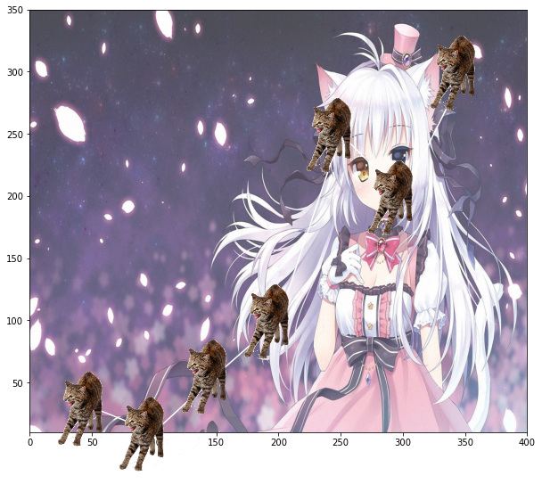

# catplotlib 	=＾● ⋏ ●＾=



Have you ever wanted to plot with cats instead of points and a boring background, and have meaowy dots and pics? Look no more.  

## Installation 

1. Clone this repository `git clone https://github.com/JairParra/catplotlib.git`. 
2. Go inside the directory (where `setup.py` is located) and install the package by executing 
```
cd catplotlib 
pip install -e . 
``` 
3. Now you can import the package as 
```python 
import catplotlib 
from catplotlib.catterplot import CatterPlot
```

## Demo 

```python
# imports
from catplotlib.catterplot import CatterPlot

# some data 
x = [50,100,150,200,250,300,350] 
y = [30,10,56,100,250,200,300] 
extent = [0,400,10,350] # size 4 list [min_x, max_x, min_y, max_y]

# load the catterplot module
cp = CatterPlot() 

# create a catterplot
cp.catterplot(x, y, 
              p='-o', # point / type 
              figsize=(10,10), # figsize used in Matplotlib.
              transparency=200, # Patterns can be ['o', '-o', '--', ...]
              extent=extent, # must be 'auto' or a size 4 list [min_x, max_x, min_y, max_y]
              cat=1, # [0, 1] 
              icon=1, # Available backgrounds are 0, ..., 1 only.
              icon_zoom = 0.3 # 
             )
```

## Copyright 

